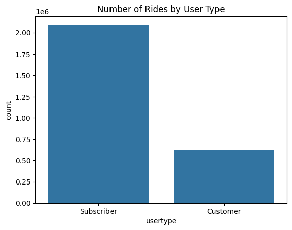
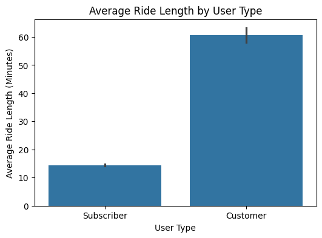
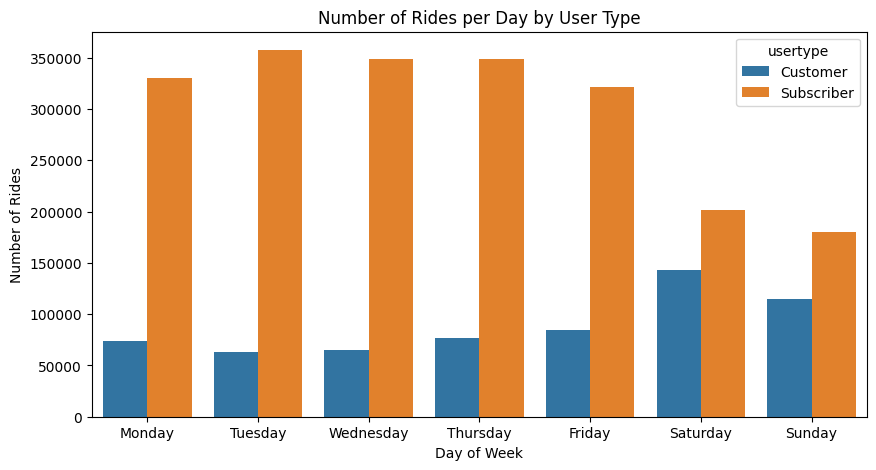
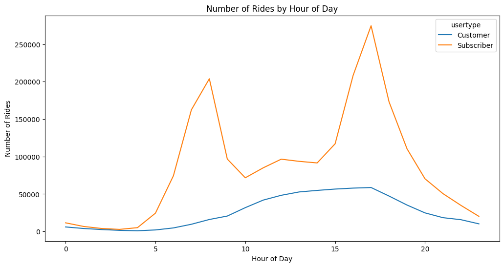

# 🚲 Cyclistic Bike-Share Analysis

## 📊 Google Data Analytics Capstone Project

This project is part of the **Google Data Analytics Professional Certificate Capstone Case Study**.
The analysis explores how **casual riders** and **annual members** use Cyclistic’s bike-share service differently and provides insights that can help the company increase annual memberships.

---

# 📌 Project Overview

Cyclistic is a fictional bike-share company based in Chicago with **thousands of bikes and hundreds of docking stations** across the city.

The company offers several pricing options:

* Single ride pass
* Full-day pass
* Annual membership

Customers who purchase **single or daily passes are considered casual riders**, while customers who purchase **annual memberships are considered members**.

Cyclistic’s marketing team believes that **annual members are more profitable than casual riders**. As a result, the company wants to understand behavioral differences between the two rider groups.

This analysis examines historical trip data to uncover **usage patterns and behavioral insights** that can support marketing strategies aimed at converting casual riders into annual members.

---

# ❓ Business Task

The marketing analytics team was asked to answer the following question:

**How do casual riders and annual members use Cyclistic bikes differently?**

Answering this question will help the company design marketing campaigns that encourage casual riders to become annual members.

---

# 🧠 Data Analytics Process

This project follows the **Google Data Analytics framework**:

### 1️⃣ Ask

Define the business problem and identify the key question.

### 2️⃣ Prepare

Collect and load Cyclistic bike trip data.

### 3️⃣ Process

Clean the data and prepare it for analysis.

### 4️⃣ Analyze

Explore the dataset to identify usage patterns.

### 5️⃣ Share

Visualize insights through charts and summaries.

### 6️⃣ Act

Provide data-driven recommendations for marketing strategies.

---

# 🛠 Tools & Technologies

The analysis was performed using:

* **Python**
* **Pandas** – data cleaning and analysis
* **Matplotlib** – data visualization
* **Seaborn** – statistical visualization
* **Jupyter Notebook** – analysis environment
* **Git & GitHub** – version control and project sharing

---

# 📂 Project Structure

```
cyclistic-bike-share-analysis
│
├── notebook
│   └── cyclistic_analysis.ipynb
│
├── visuals
│   ├── rides_by_user_type.png
│   ├── ride_length_by_user.png
│   ├── weekly_pattern.png
│   └── hourly_pattern.png
│
└── README.md
```

---

# 📊 Dataset

The dataset contains historical trip data from Cyclistic’s bike-share system.

Key fields include:

* Trip start and end times
* Ride duration
* Start and end stations
* Rider type (casual or member)

The dataset used in this analysis includes **multiple months of trip data from 2019**.

[Dataset Source](https://divvy-tripdata.s3.amazonaws.com/index.html)

---

# 📈 Key Insights

### 1️⃣ Ride Frequency

Annual members take **significantly more rides** compared to casual riders.

This suggests that members use Cyclistic bikes as part of their **daily transportation routine**, such as commuting.

---

### 2️⃣ Ride Duration

Casual riders have **longer average ride durations** compared to members.

This indicates that casual riders are more likely to use bikes for **leisure or tourism purposes** rather than commuting.

---

### 3️⃣ Weekly Usage Pattern

Clear behavioral differences appear across the week:

* **Members ride more frequently during weekdays**
* **Casual riders ride more frequently during weekends**

This further supports the idea that members use bikes for **regular commuting**, while casual riders use them for **recreational activities**.

---

### 4️⃣ Hourly Ride Pattern

Members show strong usage peaks during typical commuting hours:

* Morning commute: **around 8 AM**
* Evening commute: **around 5–6 PM**

Casual riders tend to ride more during **midday and afternoon hours**, which aligns with leisure or sightseeing behavior.

---

# 📊 Visualizations

## Number of Rides by User Type



---

## Average Ride Duration by User Type



---

## Weekly Ride Pattern



---

## Hourly Ride Pattern



---

# 💡 Business Recommendations

Based on the analysis, the following strategies could help convert casual riders into annual members:

### 1️⃣ Promote Membership Value

Highlight cost savings and convenience benefits of annual memberships for frequent riders.

### 2️⃣ Target Weekend Riders

Casual riders are highly active on weekends, making them ideal targets for marketing campaigns.

### 3️⃣ Offer Trial Memberships

Introduce short-term membership trials or discounts to encourage casual riders to upgrade.

### 4️⃣ Promote Commuting Benefits

Emphasize how Cyclistic bikes can be used for efficient and sustainable commuting.

---

# 🧠 Skills Demonstrated

This project demonstrates several data analytics skills:

* Data Cleaning
* Exploratory Data Analysis (EDA)
* Feature Engineering
* Data Visualization
* Business Insight Generation
* Data-Driven Decision Making

---

# 👩‍💻 Author

This project was completed as part of the **Google Data Analytics Professional Certificate Capstone** and serves as a **portfolio data analytics project using Python**.
